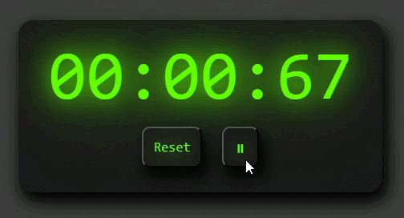

# ⏱️ Cronometro in JavaScript

👉 Live Demo https://chiaramarando.github.io/stopwatch/

Un semplice cronometro realizzato con **HTML, CSS e JavaScript**, con funzionalità di **Play/Pause**, **Reset** e gestione precisa del tempo tramite `Date.now()`.

---

## 🚀 Funzionalità

- ▶️ Avvio del cronometro
- ⏸ Pausa e ripresa
- 🔄 Reset completo
- ⏱ Visualizzazione in formato `mm:ss:cc` (minuti, secondi, centesimi)
- ⚡ Timer preciso basato su `Date.now()` (no drift di `setInterval`)

---

## 🛠 Tecnologie utilizzate

- HTML5
- CSS3
- JavaScript (Vanilla)

---

## 🧠 Cosa ho imparato

Durante lo sviluppo di questo progetto ho lavorato su:

- Manipolazione del DOM
- Gestione degli eventi (`addEventListener`)
- Gestione dello stato (`isRunning`)
- Differenza tra contare il tempo e misurarlo
- Utilizzo di `Date.now()` per creare timer precisi
- Formattazione del tempo (minuti, secondi, centesimi)

---

## 📸 Preview



---

## 📂 Struttura del progetto

```
/project-folder
  ├── index.html
  ├── style.css
  └── script.js
```

---

## ▶️ Come usarlo

Puoi provare il cronometro direttamente online:

👉 Live Demo https://chiaramarando.github.io/stopwatch/

Oppure in locale:

Clona il repository
Apri index.html nel browser

Utilizza i bottoni:

▶️ Play per avviare
⏸ Pausa per fermare
🔄 Reset per azzerare

---

## 💡 Possibili miglioramenti

- ⏱ Aggiungere funzionalità "Lap"
- 💾 Salvare lo stato con `localStorage`
- 🎨 Migliorare l'interfaccia grafica
- ⌨️ Aggiungere controlli da tastiera

---

## 👩‍💻 Autore

Progetto sviluppato da Chiara Marando

---
